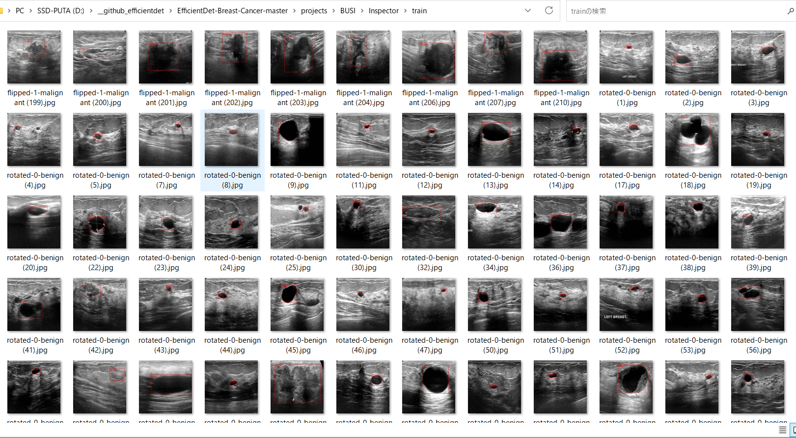
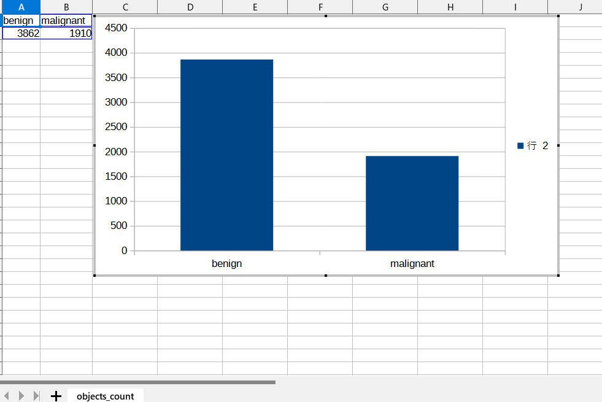
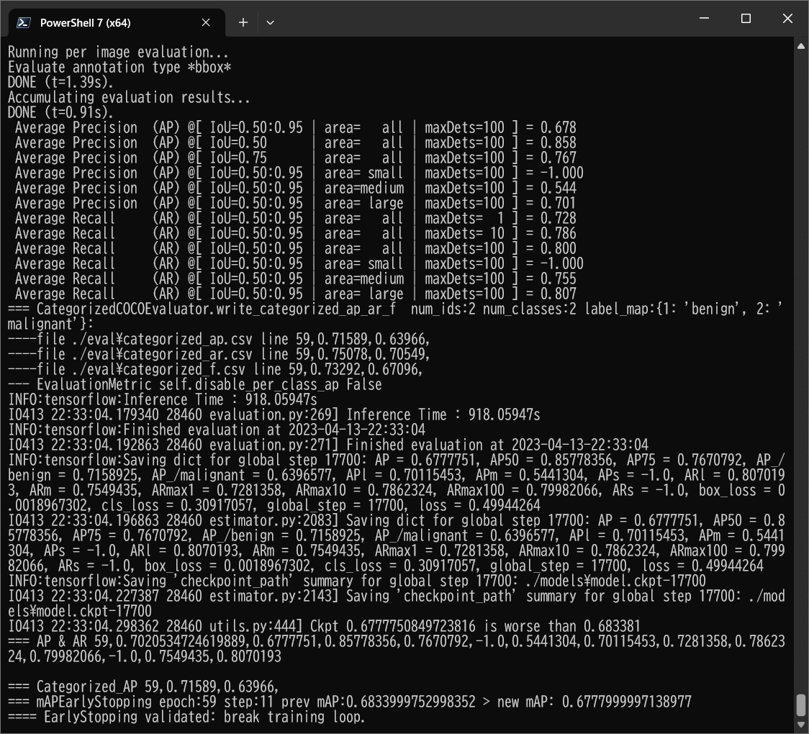
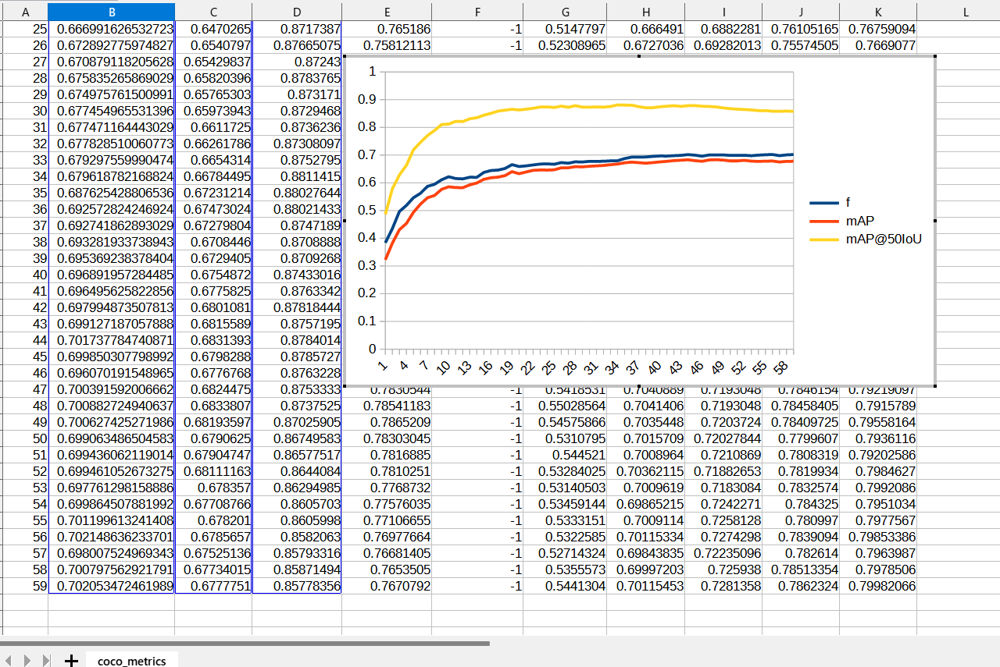
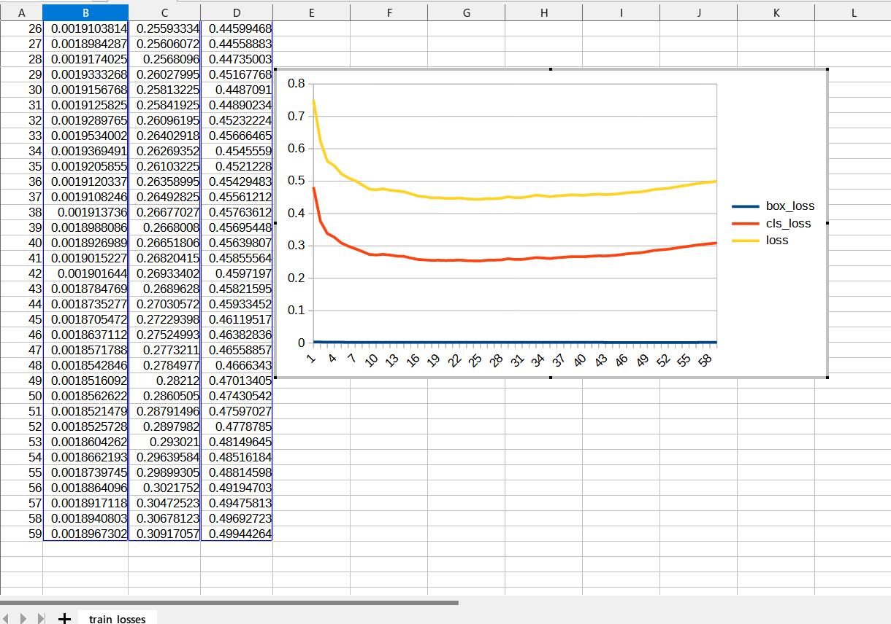
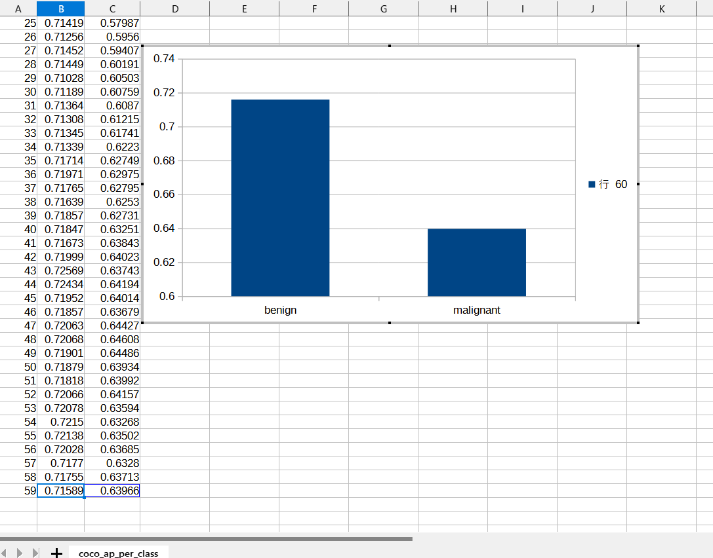
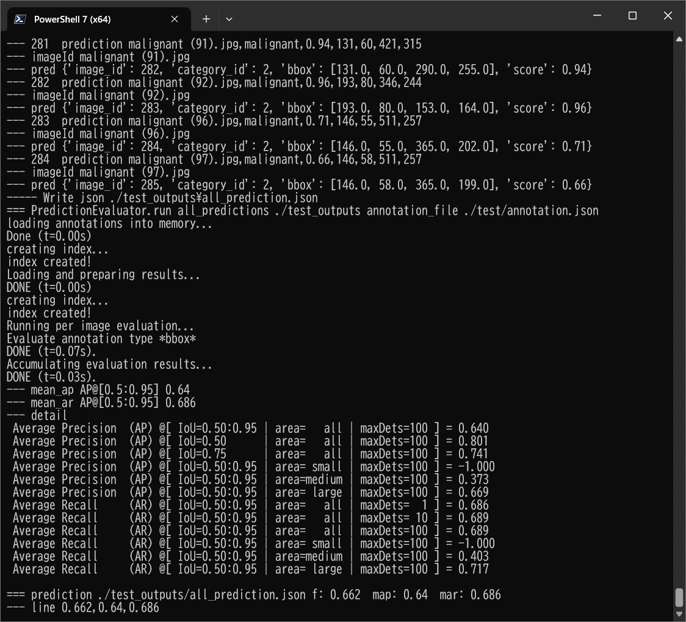

<h2>
EfficientDet-Augmented-Breast-Ultrasound-Images (Updated: 2023/04/14)
</h2>
This is an experimental project to detect <b>Breast Cancer</b> based on Augmented
Breast Ultrasound Images Dataset (BUSI), by using Google Brain AutoML
<a href="https://github.com/google/automl/tree/master/efficientdet"> EfficientDet.</a> 
The original dataset used here has been take from the followin web site: 
<b>Breast Ultrasound Images Dataset</b> 
Breast ultrasound images for classification, detection & segmentation 

<pre>
https://www.kaggle.com/datasets/aryashah2k/breast-ultrasound-images-dataset
</pre>
Citation: 
<pre>
Al-Dhabyani W, Gomaa M, Khaled H, Fahmy A. 
Dataset of breast ultrasound images. Data in Brief. 
2020 Feb;28:104863. 
DOI: 10.1016/j.dib.2019.104863.
</pre>

In a project <a href="https://github.com/sarah-antillia/EfficientDet-Breast-Cancer">EfficientDet-Breast-Cancer</a>, 
we have already tried to detect Breast Cancer by EfficientDet model trained by original BUSI Dataset. 
However, the cancer detection accuracy by that model is very low.

This is another experiment to improve the detection accuracy of Breast Cancer by new EfficientDet model trained 
by <b>Augmented BUSI Dataset</b>. 

We have created <b>YOLO</b> and <b>TFRecord Augmented BUSI Dataset</b> from the original <b>Breast Ultrasound Images Dataset</b>, by using the following tools. 

<a href="https://github.com/sarah-antillia/YOLO-Breast-UltraSound-Images">YOLO-Breast-UltraSound-Images</a>. 

<a href="https://github.com/sarah-antillia/AnnotationConverters">AnnotationConverters</a>.  

<h2>
1. Installing tensorflow on Windows11
</h2>
We use Python 3.8.10 to run tensoflow 2.11.1 on Windows11. 
<h3>1.1 Install Microsoft Visual Studio Community</h3>
Please install <a href="https://visualstudio.microsoft.com/ja/vs/community/">Microsoft Visual Studio Community</a>, 
which can be ITed to compile source code of 
<a href="https://github.com/cocodataset/cocoapi">cocoapi</a> for PythonAPI. 
<h3>1.2 Create a python virtualenv </h3>
Please run the following command to create a python virtualenv of name <b>py38-efficientdet</b>.
<pre>
>cd c:\
>python38\python.exe -m venv py38-efficientdet
>cd c:\py38-efficientdet
>./scripts/activate
</pre>
<h3>1.3 Create a working folder </h3>
Please create a working folder "c:\google" for your repository, and install the python packages. 

<pre>
>mkdir c:\google
>cd    c:\google
>pip install cython
>git clone https://github.com/cocodataset/cocoapi
>cd cocoapi/PythonAPI
</pre>
You have to modify extra_compiler_args in setup.py in the following way:
<pre>
   extra_compile_args=[]
</pre>
<pre>
>python setup.py build_ext install
</pre>

 
<h2>
2. Installing EfficientDet-Augmented-Breast-Ultrasound-Images
</h2>
<h3>2.1 Clone repository</h3>
Please clone EfficientDet-Augmented-Breast-Ultrasound-Images.git in 
your working folder <b>c:\google</b>. 
<pre>
>git clone https://github.com/sarah-antillia/EfficientDet-Augmented-Breast-Ultrasound-Images.git 
</pre>
You can see the following folder <b>projects</b> in EfficientDet-Augmented-Breast-Ultrasound-Images of the working folder. 

<pre>
EfficientDet-Augmented-Breast-Ultrasound-Images
└─projects
      └─BUSI
          ├─eval
          ├─saved_model
          ├─test
          └─test_outputs
</pre>
<h3>2.2 Install python packages</h3>

Please run the following command to install python packages for this project. 
<pre>
>cd ./EfficientDet-Augmented-Breast-Ultrasound-Images
>pip install -r requirements.txt
</pre>

 
<h3>2.3 Download TFRecord Dataset</h3>
 If you would like to retrain the BUSI EfficientDet model,
 please download TFRecord dataset (TFRecord-BUSI-20230414.zip) from <a href="https://drive.google.com/file/d/1XaqPnH90ZQ9_FuwaUZSvwcUPWS7BdRvE/view?usp=share_link">here</a>
, expand it in your working folder, and move <b>train</b> and <b>valid</b> folders to <b>,/projects/BUSI</b>. 

<pre>
EfficientDet-Augmented-Breast-Ultrasound-Images
└─projects
      └─BUSI
          ├─train
          └─valid
</pre>

<h3>2.4 Workarounds for Windows</h3>
As you know or may not know, the efficientdet scripts of training a model and creating a saved_model do not 
run well on Windows environment in case of tensorflow 2.8.0 (probably after the version 2.5.0) as shown below:. 
<pre>
INFO:tensorflow:Saving checkpoints for 0 into ./models\model.ckpt.
I0609 06:22:50.961521  3404 basic_session_run_hooks.py:634] Saving checkpoints for 0 into ./models\model.ckpt.
2022-06-09 06:22:52.780440: W tensorflow/core/framework/op_kernel.cc:1745] OP_REQUIRES failed at save_restore_v2_ops.cc:110 :
 NOT_FOUND: Failed to create a NewWriteableFile: ./models\model.ckpt-0_temp\part-00000-of-00001.data-00000-of-00001.tempstate8184773265919876648 :
</pre>

The real problem seems to happen in the original <b> save_restore_v2_ops.cc</b>. The simple workarounds to the issues are 
to modify the following tensorflow/python scripts in your virutalenv folder. 
<pre>
c:\py38-efficientdet\Lib\site-packages\tensorflow\python\training
 +- basic_session_run_hooks.py
 
634    logging.info("Saving checkpoints for %d into %s.", step, self._save_path)
635    ### workaround date="2022/06/18" os="Windows"
636    import platform
637    if platform.system() == "Windows":
638      self._save_path = self._save_path.replace("/", "\\")
639    #### workaround
</pre>

<pre>
c:\py38-efficientdet\Lib\site-packages\tensorflow\python\saved_model
 +- builder_impl.py

595    variables_path = saved_model_utils.get_variables_path(self._export_dir)
596    ### workaround date="2022/06/18" os="Windows" 
597    import platform
598    if platform.system() == "Windows":
599      variables_path = variables_path.replace("/", "\\")
600    ### workaround
</pre>
 
<h3>3. Inspect tfrecord</h3>
  Move to ./projects/BUSI directory, and run the following bat file: 
<pre>
tfrecord_inspect.bat
</pre>
, which is the following:
<pre>
python ../../TFRecordInspector.py ^
  ./train/*.tfrecord ^
  ./label_map.pbtxt ^
  ./Inspector/train
</pre>
 
This will generate annotated images with bboxes and labels from the tfrecord, and cout the number of annotated objects in it. 
 
<b>TFRecordInspecotr: annotated images in train.tfrecord</b> 

 
 
<b>TFRecordInspecotr: objects_count train.tfrecord</b> 

 
This bar graph shows that the number of the objects contained in train.tfrecord,
from which you can see that it contains 5772 images in total. 
 
 
<h3>4. Download the pretrained-model efficientdet-d0</h3>
Please download an EfficientDet model chekcpoint file <b>efficientdet-d0.tar.gz</b>, and expand it in <b>EfficientDet-IT-RoadSigns</b> folder. 
 
https://storage.googleapis.com/cloud-tpu-checkpoints/efficientdet/coco2/efficientdet-d0.tar.gz
 
See: https://github.com/google/automl/tree/master/efficientdet 

<h3>5. Train Breast-Cancer Model by using the pretrained-model</h3>
Please change your current directory to <b>./projects/BUSI</b>,
and run the following bat file to train Breast-Cancer EfficientDet Model by using the train and valid tfrecords.
<pre>
1_train.bat
</pre>
<pre>
python ../../ModelTrainer.py ^
  --mode=train_and_eval ^
  --train_file_pattern=./train/*.tfrecord  ^
  --val_file_pattern=./valid/*.tfrecord ^
  --model_name=efficientdet-d0 ^
  --hparams="image_size=512x512,num_classes=2,label_map=./label_map.yaml" ^
  --model_dir=./models ^
  --label_map_pbtxt=./label_map.pbtxt ^
  --eval_dir=./eval ^
  --ckpt=../../efficientdet-d0  ^
  --train_batch_size=4 ^
  --early_stopping=map ^
  --patience=10 ^
  --eval_batch_size=4 ^
  --eval_samples=400  ^
  --num_examples_per_epoch=1200 ^
  --num_epochs=100
</pre>

<table style="border: 1px solid #000;">
<tr>
<td>
--mode</td><td>train_and_eval</td>
</tr>
<tr>
<td>
--train_file_pattern</td><td>./train/*.tfrecord</td>
</tr>
<tr>
<td>
--val_file_pattern</td><td>./valid/*.tfrecord</td>
</tr>
<tr>
<td>
--model_name</td><td>efficientdet-d0</td>
</tr>
<tr><td>
--hparams</td><td>"image_size=512x512,num_classes=2,label_map=./label_map.yaml"
</td></tr>
<tr>
<td>
--model_dir</td><td>./models</td>
</tr>
<tr><td>
--label_map_pbtxt</td><td>./label_map.pbtxt
</td></tr>

<tr><td>
--eval_dir</td><td>./eval
</td></tr>

<tr>
<td>
--ckpt</td><td>../../efficientdet-d0</td>
</tr>
<tr>
<td>
--train_batch_size</td><td>4</td>
</tr>
<tr>
<td>
--early_stopping</td><td>map</td>
</tr>
<tr>
<td>
--patience</td><td>10</td>
</tr>

<tr>
<td>
--eval_batch_size</td><td>1</td>
</tr>
<tr>
<td>
--eval_samples</td><td>400</td>
</tr>
<tr>
<td>
--num_examples_per_epoch</td><td>1200</td>
</tr>
<tr>
<td>
--num_epochs</td><td>100</td>
</tr>
</table>
 
 
<b>label_map.yaml:</b>
<pre>
1: 'benign'
2: 'malignant'
</pre>

 
<b><a href="./projects/BUSI/eval/coco_metrics.csv">COCO metrics at epoch 59</a></b> 

 

 
<b><a href="./projects/BUSI/eval/coco_metrics.csv">COCO metrics f and map</a></b> 

 
 
<b><a href="./projects/BUSI/eval/train_losses.csv">Train losses</a></b> 

 
 

<b><a href="./projects/BUSI/eval/coco_ap_per_class.csv">COCO ap per class</a></b> 

 

<h3>
6. Create a saved_model from the checkpoint
</h3>
  Please run the following bat file to create a saved_model from the checkpoint files in <b>./models</b> folder.  
<pre>
2_create_saved_model.bat
</pre>
, which is the following:
<pre>
rem 2_create_saved_model.bat  
python ../../SavedModelCreator.py ^
  --runmode=saved_model ^
  --model_name=efficientdet-d0 ^
  --ckpt_path=./models  ^
  --hparams="image_size=512x512,num_classes=2" ^
  --saved_model_dir=./saved_model
</pre>

<table style="border: 1px solid #000;">
<tr>
<td>--runmode</td><td>saved_model</td>
</tr>

<tr>
<td>--model_name </td><td>efficientdet-d0 </td>
</tr>

<tr>
<td>--ckpt_path</td><td>./models</td>
</tr>

<tr>
<td>--hparams</td><td>"image_size=512x512,num_classes=2"</td>
</tr>

<tr>
<td>--saved_model_dir</td><td>./saved_model</td>
</tr>
</table>

 
 
<h3>
7. Inference Breast-Cancer by using the saved_model
</h3>
<h3>7.1 Inference scripts</h3>
 Please run the following bat file to infer Breast Cancer mages of test dataset:
<pre>
3_inference.bat
</pre>
, which is the following:
<pre>
rem 3_inference.bat
python ../../SavedModelInferencer.py ^
  --runmode=saved_model_infer ^
  --model_name=efficientdet-d0 ^
  --saved_model_dir=./saved_model ^
  --min_score_thresh=0.4 ^
  --hparams="num_classes=2,label_map=./label_map.yaml" ^
  --input_image=./test/*.jpg ^
  --classes_file=./classes.txt ^
  --ground_truth_json=./test/annotation.json ^
  --output_image_dir=./test_outputs
</pre>

<table style="border: 1px solid #000;">
<tr>
<td>--runmode</td><td>saved_model_infer </td>
</tr>
<tr>
<td>--model_name</td><td>efficientdet-d0 </td>
</tr>

<tr>
<td>--saved_model_dir</td><td>./saved_model </td>
</tr>

<tr>
<td>--min_score_thresh</td><td>0.4 </td>
</tr>

<tr>
<td>--hparams</td><td>"num_classes=2,label_map=./label_map.yaml"</td>
</tr>

<tr>
<td>--input_image</td><td>./test/*.jpg</td>
</tr>

<tr>
<td>--classes_file</td><td>./classes.txt</td>
</tr>

<tr>
<td>--ground_truth_json</td><td>./test/annotation.json</td>
</tr>

<tr>
<td>--output_image_dir</td><td>./test_outputs</td>
</tr>
</table>

 

 
<h3>

7.2. Some Inference results of Breast-Cancer
</h3>
 
<a href="./projects/BUSI/test_outputs//benign (1).jpg_objects.csv">benign (1).jpg_objects.csv</a> 
 

 
<a href="./projects/BUSI/test_outputs//benign (5).jpg_objects.csv">benign (7).jpg_objects.csv</a> 
 

 
<a href="./projects/BUSI/test_outputs//benign (17).jpg_objects.csv">benign (19).jpg_objects.csv</a> 
 

 
<a href="./projects/BUSI/test_outputs//benign (32).jpg_objects.csv">benign (33).jpg_objects.csv</a> 
 

 
<a href="./projects/BUSI/test_outputs//benign (54).jpg_objects.csv">benign (54).jpg_objects.csv</a> 
 

 
<a href="./projects/BUSI/test_outputs//malignant (33).jpg_objects.csv">malignant (34).jpg_objects.csv</a> 
 

 
<a href="./projects/BUSI/test_outputs//malignant (72).jpg_objects.csv">malignant (71).jpg_objects.csv</a> 
 

 
<a href="./projects/BUSI/test_outputs//malignant (125).jpg_objects.csv">malignant (1).jpg_objects.csv</a> 
 

 
<a href="./projects/BUSI/test_outputs//malignant (196).jpg_objects.csv">malignant (196).jpg_objects.csv</a> 
 

 
<a href="./projects/BUSI/test_outputs//malignant (204).jpg_objects.csv">malignant (202).jpg_objects.csv</a> 
 

<h3>7.3. COCO metrics of inference result</h3>
The 3_inference.bat computes also the COCO metrics(f, map, mar) to the <b>realistic_test_dataset</b> as shown below: 
<a href="./projects/BUSI/test_outputs/prediction_f_map_mar.csv">prediction_f_map_mar.csv</a>

 
 
<b><a href="./projects/BUSI/eval/coco_metrics.csv">COCO metrics at epoch 59</a></b> 

 
 
<h3>
References
</h3>
<b>1. Breast Ultrasound Images Dataset</b> 
Breast ultrasound images for classification, detection & segmentation 
<pre>
https://www.kaggle.com/datasets/aryashah2k/breast-ultrasound-images-dataset
</pre>
Citation: 
<pre>
Al-Dhabyani W, Gomaa M, Khaled H, Fahmy A. 
Dataset of breast ultrasound images. Data in Brief. 
2020 Feb;28:104863. 
DOI: 10.1016/j.dib.2019.104863.
</pre>

<b>2. Breast lesion detection using an anchor-free network from ultrasound images with segmentation-based enhancement</b> 
Yu Wang & Yudong Yao 
<pre>
https://www.nature.com/articles/s41598-022-18747-y
</pre>

<b>3. Classification of Breast Cancer Ultrasound Images with Deep Learning-Based Models </b> 
Fatih Uysa,and Mehmet Murat Köse 
<pre>
https://www.mdpi.com/2673-4591/31/1/8/html
</pre>

<b>4. A CNN Deep Learning Technique for Prediction of Breast Cancer using Ultrasound Image
</b> 
Atisham Khan and Silky Pareyani 
<pre>
https://www.jetir.org/papers/JETIR2303813.pdf
</pre>

